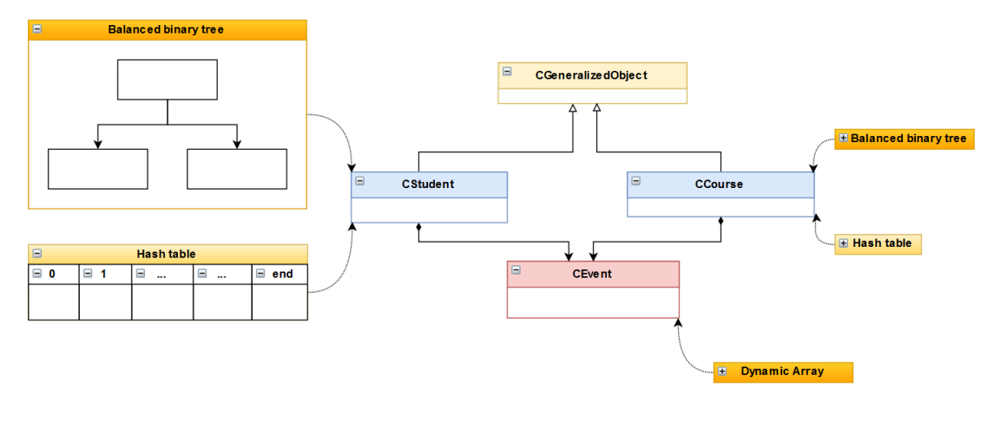

# Database Engine Rough Simulation

An information management system based on the objects' event lists.

Executable File Download: [Google Drive](https://drive.google.com/drive/folders/1ErRYQEHcgGkmwWlM30nlNxFv2UEhiPAb?usp=sharing)

Features:
- Object oriented design
- Large dataset support (the initial dataset is 60 MB)
- Optimized querying performance with hash tables and balanced binary trees
- (To practice coding) Did not use any 3rd party libraries, such as STL
- Can be applied to student information management, supermarket stock management, etc

---

# 数据库引擎简单仿真

基于对象的事件列表的信息管理系统。

可执行文件下载：[蓝奏云](https://wws.lanzous.com/iDQnxeb0gbc)

特色：
- 面向对象的设计
- 支持大型数据集（初始数据文件60MB）
- 使用哈希表和平衡二叉树提升了查询速度
- (为了练习编程)没有使用任何第三方库（如STL）
- 可以应用于学生信息管理，超市库存管理等场景
